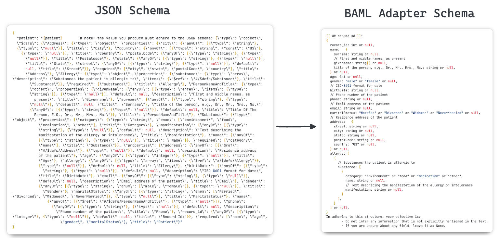

# Experiments with DSPy and BAML

This repo contains code that runs the same structured output tasks using both DSPy and BAML.
The goal is not to compare the two frameworks directly, but to explore their capabilities more
deeply and understand the nuanced differences in their approaches.

## Dataset

### Source of truth

The sample data for structured extraction is a dataset of 2,726 FHIR records of patients and their notes.
It's obtained from this [Hugging Face dataset](https://huggingface.co/datasets/kishanbodybrain/test-fhir/tree/main/data),
and the parquet files are transformed into JSON. This raw JSON file of FHIR healthcare records
(`data/raw_fhir.json`) serves as our source of truth for evaluating the structured output performance
from either approach.

### Patient notes

The unstructured data for patient notes is present in this same dataset from Hugging Face. The goal
of structured extraction is to extract relevant information (via a schema) from these unstructured notes
and store them in a JSON file. This result can then be compared against the source of truth data (which
was human-annotated).

See the [./data](./data) directory for the raw and processed data files that are used in the experiments.

## Setup

It's recommended to [install uv](https://docs.astral.sh/uv/getting-started/installation/) to manage the dependencies.

```bash
uv sync
```

Install any additional Python packages via `uv add <package_name>`.

## Evaluation

The results from the BAML and DSPy runs are output to their respective `data/structured_output_*.json` 
files. The evaluation script is run as follows:

```bash
# Indicate that the output file is from BAML
uv run evaluate.py -o baml
# # Indicate that the output file is from DSPy
uv run evaluate.py -o dspy
```

See the evaluation results in the `./src/baml`  and `./src/dspy` directories for more information.

## Takeaways

The experiments clearly show that BAML's schema representation in the prompt sent to the LLM is more
concise and token-efficient compared to DSPy's default JSON schema (far more verbose and messy for
LLMs to reason about). However, DSPy allows users to define [custom adapters](https://dspy.ai/learn/programming/language_models/?h=adapter#advanced-building-custom-lms-and-writing-your-own-adapters),
which is very helpful -- we can then compare the effect of the schema representation by
writing a custom [`BAMLAdapter`](./src/dspy/baml_adapter.py) for DSPy that achieves a similar level of performance.

See below for a comparison of the two schema representations.


The results for experiments that use the BAML adapter are shown in the [src/dspy](./src/dspy) directory.